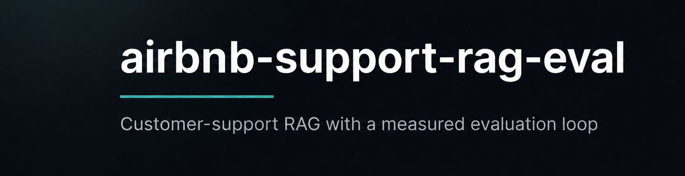

<p align="center">
  
</p>

# airbnb-support-rag-eval — Customer-support RAG with a measured evaluation loop

**TL;DR** — A Q&A bot over the Airbnb Help Center that answers **only** from the
documentation and **refuses when the answer isn't there**. The real work isn't the bot
— it's the **measurement harness** around it. It let me prove, in numbers, that (a) a
naive prompt makes things up on **100%** of trick questions while the grounded one hits
**0%**, and (b) the biggest bug in the whole project was in my own *evaluator*, not the
bot. Built on 6 years of customer-support / data-quality / annotation work.

> **Plain-language glossary:** *retrieval* = finding the right paragraphs in the docs ·
> *recall@k* = how often the correct paragraph is among the top-k retrieved ·
> *grounding* = forcing the model to answer only from those paragraphs and cite them ·
> *hallucination* = answering when it shouldn't · *LLM-judge* = a second model that
> scores the answers.

RAG system over the **Airbnb Help Center** (cancellations, refunds, AirCover,
host/guest policies) with a full evaluation harness: a hand-annotated golden
dataset, deterministic retrieval metrics, and an LLM-as-judge whose reliability I
actively monitor (parse-health, cross-model judging). The point of the project is not
the chatbot — it is the loop: *build → measure → find the weakest link → fix → show
the delta in numbers*.

This is the exact system a support team would deploy: answer the customer strictly
from the knowledge base, and — critically — refuse and escalate when the answer is
not documented, instead of promising a refund that policy doesn't cover.

## Results by iteration

Generator: `deepseek-v4-flash` (Ollama Cloud). Judge: `gpt-oss:120b` — a different
model on the same platform (cross-model judging). All rows judged by the same model
(97/97 verdicts parsed each — see the judge-health note). 115 questions
(50 factual / 47 synthesis / 18 adversarial). Each row changes ONE variable.

| Iteration | Recall@k | MRR | Faithfulness | Correctness | Hallucination | Citation |
|---|---|---|---|---|---|---|
| v0 vector-only, naive prompt | 0.448 | 0.425 | 4.61 | 4.07 | 1.00 | 0.07 |
| v1 + hybrid (RRF vector + BM25) | 0.418 | 0.385 | 4.73 | 4.00 | 1.00 | 0.04 |
| v2 + cross-encoder rerank | 0.552 | 0.485 | 4.57 | 4.06 | 1.00 | 0.10 |
| v3 + grounding prompt & citations | 0.552 | 0.485 | 4.37 | 2.59 | **0.00** | **0.99** |
| v4 + retrieval depth k=5 → 8 | **0.619** | 0.493 | 4.25 | 2.73 | **0.00** | **0.99** |

**Retrieval (v0→v2, v4).** Hybrid *regressed* vs pure vector (BM25 latched onto
repeated site chrome); the cross-encoder rerank recovered it (+0.13); raising k to 8
was the other real lever (0.619). Boilerplate cleaning (the `--clean` ingest step)
moved recall only within noise — kept because it's tidier, but honestly not the lever.

**The prompt ablation (v2 → v3) is the sharp result.** Same retrieval, only the prompt
changes naive → grounded:
- Hallucination **1.00 → 0.00** — the naive prompt answers all 18 adversarial
  (unanswerable) questions; the grounding + refusal contract refuses every one.
- Citation validity **0.10 → 0.99** — answers become grounded and cite their chunks.
- Correctness **4.06 → 2.59** — it *drops*, and that is the point: the naive prompt
  scores "higher" only because it always answers, including confidently making things
  up. Grounding trades raw correctness for **safety and citability** — exactly the
  trade a support bot must make (never invent a refund policy). On the questions it
  actually answers, grounded correctness is ~4/5; the average is pulled down by safe
  refusals when retrieval misses. **So the remaining bottleneck is retrieval recall,
  not generation.**

### The biggest bug was in the meter, not the system

The first "results" were a trap: the judge (`deepseek-v4-pro`, a *reasoning* model)
spent its output budget thinking, so on a low token cap the JSON verdict was truncated
and failed to parse — **85% of scores were silently dropped**, and `correctness` was a
mean over ~12% of the data (a meaningless ≈1.8). Caught by monitoring the judge's
**parse-error rate**, fixed with a larger token budget, a tolerant parser, and a
non-reasoning judge (`gpt-oss:120b`) — parse errors went **85% → 0** (97/97 verdicts on
every row above). Lesson: instrument the evaluation harness itself, not just the system
under test. `run_eval` now reports `judge_scored` (parsed verdicts / N) so a broken
judge can never masquerade as a real score again.

*(re-run any row with `python -m eval.run_eval --tag <iteration>`; summaries land in
`eval/results/`)*

## Architecture

```
INDEXING (offline)
PDF → parse → chunk → embeddings → Chroma
                                 → BM25 index

QUERY (online)
question → hybrid retrieval (RRF over vector + BM25, top-k)
         → LLM with grounding prompt ("answer only from context, cite chunks")
         → answer + citations [c0012] validated by code
         → request log (chunks, latency, tokens)

EVALUATION (separate loop — the heart of the project)
golden dataset (115 Q&A) → pipeline run → metrics → report
```

## Evaluation methodology (see EVALUATION.md)

- **Golden dataset**: 115 real support questions (50 factual, 47 synthesis, 18
  adversarial/unanswerable) collected from Airbnb forums and Reddit, annotated per
  `eval/annotation_guidelines.md` — written the way I would write guidelines for a
  support/annotation team.
- **Retrieval metrics** (deterministic, no LLM): recall@k, MRR.
- **Generation metrics**: faithfulness and correctness via LLM judge
  (`eval/judge_rubric.md`), hallucination rate on adversarial questions,
  citation validity checked by code.
- **Judge health (done)**: every run reports `judge_scored` (parsed verdicts / N).
  This caught a real failure — the judge silently dropped 85% of its scores — before
  those numbers were ever trusted (see the results section).
- **Judge calibration (provided workflow, next step)**: `eval/calibrate_judge.py`
  compares a batch of my own hand labels against the judge (exact / within-1 agreement,
  Spearman ρ) so the rubric can be tightened until they agree — the annotator-calibration
  workflow from data-quality work, ported to code. Not yet run with a full hand-labelled
  batch; it's the intended next iteration, not a claimed result.

## Quickstart

**Easiest (macOS):** double-click `launch.command` in Finder. It opens Terminal
and walks you through provider → model (from the server's live list) → what to run
(API server, an interactive Q&A prompt, or the full eval). Your choices are saved
to `.env`. If double-click is blocked, right-click → Open the first time.

Manual:

```bash
pip install -r requirements.txt
cp .env.example .env   # set OLLAMA_API_KEY (default provider is Ollama Cloud)

# 0. Pick the generation model from the list the server offers (interactive)
python -m src.select_model

# 1. Ingest + index  (--clean strips repeated site boilerplate; ids stay stable)
python -m src.ingest path/to/airbnb_help.pdf --strategy fixed --clean
python -m src.index

# 2. Ask
uvicorn src.api:app --reload
curl -X POST localhost:8000/ask -H 'Content-Type: application/json' \
  -d '{"question": "When do I get a full refund if I cancel?"}'

# 3. Evaluate — reproduces the results table, ONE variable changes per row
python -m eval.run_eval --mode vector          --prompt naive    --tag v0
python -m eval.run_eval --mode hybrid          --prompt naive    --tag v1
python -m eval.run_eval --mode hybrid --rerank --prompt naive    --tag v2
python -m eval.run_eval --mode hybrid --rerank --prompt grounded --tag v3
python -m eval.run_eval --mode hybrid --rerank --prompt grounded --k 8 --tag v4
```

**Optional — structure-aware re-chunking.** Switching `--strategy structure`
renumbers chunks, so the golden dataset's `relevant_chunk_ids` must be remapped:

```bash
cp data/chunks.jsonl data/chunks.old.jsonl
python -m src.ingest path/to/airbnb_help.pdf --strategy structure && python -m src.index
python -m eval.remap_chunk_ids --old data/chunks.old.jsonl --new data/chunks.jsonl \
    --golden eval/golden_dataset.jsonl --out eval/golden_dataset.v2.jsonl
# review flagged (low-confidence) mappings, then point GOLDEN_DATASET at the new file
```

Docker: `docker compose up --build`

## Key design decisions

- **Hybrid retrieval (RRF)** — the Help Center is full of exact terms
  ("AirCover", "Strict policy", "reservation ID") where BM25 wins, and paraphrased
  customer questions ("I can't get into the apartment") where embeddings win;
  fusion beats either alone (see results table).
- **Two-stage retrieval (v2)** — hybrid retrieval pulls a wide pool (top-20)
  cheaply, a local cross-encoder re-scores (query, chunk) pairs jointly and
  keeps top-k. Bi-encoders miss fine-grained distinctions ("Flexible" vs "Strict"
  cancellation policy); the cross-encoder reads both texts together. +~200ms CPU latency,
  zero API cost. Chunk-id drift after re-chunking is handled by
  `eval/remap_chunk_ids.py` (deterministic Jaccard mapping + manual review of
  low-confidence cases).
- **Mandatory citations validated by code** — the model must cite `[cNNNN]`;
  the pipeline rejects citations that don't exist in the retrieved set. Cheap,
  deterministic guardrail against fabricated grounding.
- **Explicit refusal token** — `NOT_IN_DOCUMENT` makes hallucination rate
  measurable with a string check instead of another LLM call.
- **Prompt as an ablation, not a rewrite (v3)** — both prompt variants
  (`naive`, `grounded`) live in the codebase and are switchable per request and
  per eval run (`--prompt`). v3's hallucination delta is attributable to the
  grounding contract alone because it's the only variable changed.
- **No LangChain in v1** — direct SDK calls to understand the mechanics;
  a LangGraph rewrite lives in `variants/` for comparison (same Retriever, same
  prompt contract — the comparison is about the framework, not the pipeline).
- **Provider abstraction** (`src/providers.py`) — generation and the eval judge
  both route through one `chat()` call, so the LLM backend is a config flag
  (`LLM_PROVIDER=ollama|anthropic`), not a code change. Default is **Ollama Cloud**:
  the model is chosen from the live list the server returns
  (`python -m src.select_model`, saved to `data/selected_model.txt`), so the same
  harness can benchmark any hosted model without touching the pipeline.

## Observability

Every request is logged to `data/requests.log.jsonl` with retrieved chunks,
latency, token usage and estimated cost. Optional [Langfuse](https://langfuse.com)
tracing (self-hosted or cloud) is a no-op unless enabled:

```bash
pip install "langfuse>=2,<3"
export LANGFUSE_ENABLED=true LANGFUSE_PUBLIC_KEY=... LANGFUSE_SECRET_KEY=...
```

Tracing failures never break the request path (`src/tracing.py`).

## Deployment

**HuggingFace Spaces (Docker Space, free tier):** push the repo to a Space,
set `OLLAMA_API_KEY` in Space secrets (default provider is Ollama Cloud; use
`ANTHROPIC_API_KEY` instead if you set `LLM_PROVIDER=anthropic`). The Dockerfile
respects `PORT` (Spaces injects 7860). Index data is baked in by committing `data/`
or built at startup.

**VPS:** `docker compose up -d --build` behind any reverse proxy; `data/` is a
volume, so the index survives rebuilds.

## Repo layout

```
src/      ingest / index / retrieval / rerank / generation / pipeline / tracing / api
eval/     golden_dataset.jsonl, annotation_guidelines.md, judge_rubric.md,
          run_eval.py, calibrate_judge.py, remap_chunk_ids.py, find_chunks.py, results/
variants/ langgraph_pipeline.py — framework comparison, separate requirements
tests/    unit tests (chunking, rerank, remap, prompts)
```

## License & data

The **code** in this repository is released under the [MIT License](LICENSE).

`data/airbnb_help.pdf` is public content from the Airbnb Help Center
(airbnb.com/help), included **solely for evaluation and demonstration** of the
retrieval/eval pipeline. It remains the property of Airbnb, is **not** covered by
this project's license, and is not affiliated with or endorsed by Airbnb. To rebuild
it from source instead, run `python -m scripts.scrape_airbnb --urls scripts/airbnb_urls.txt`.
